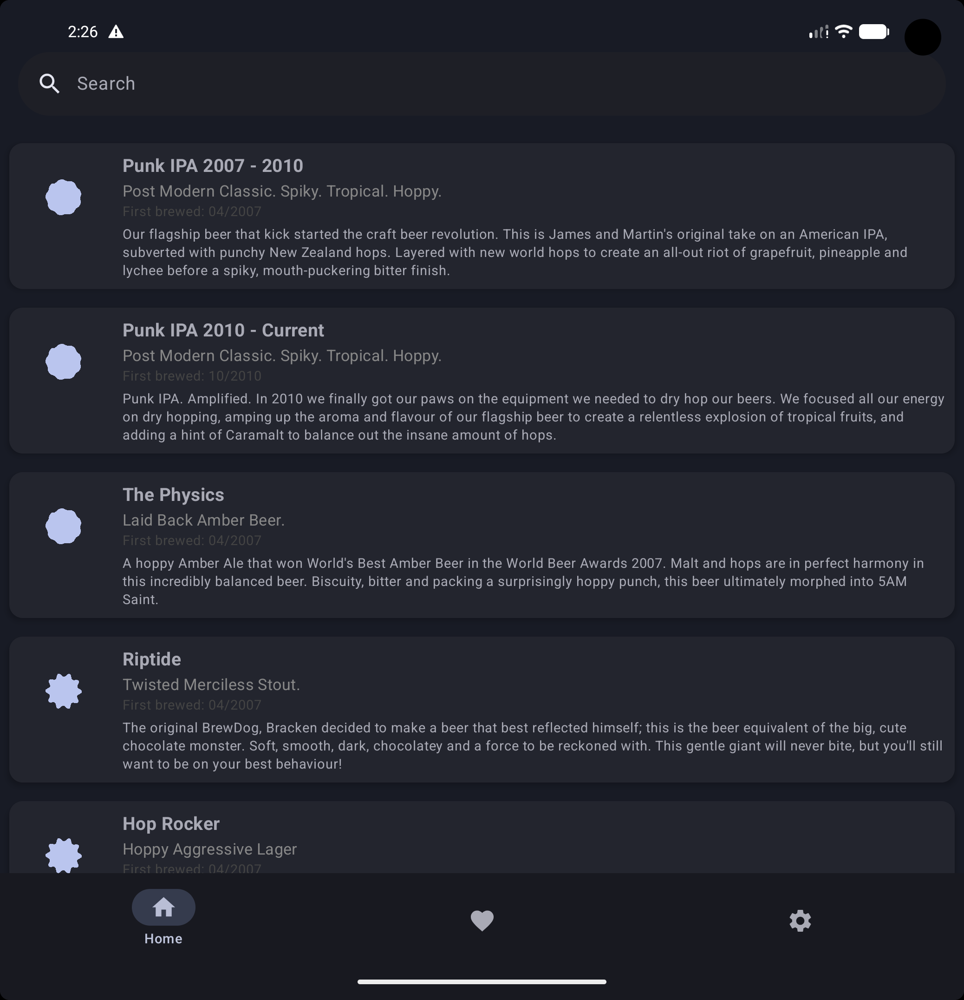
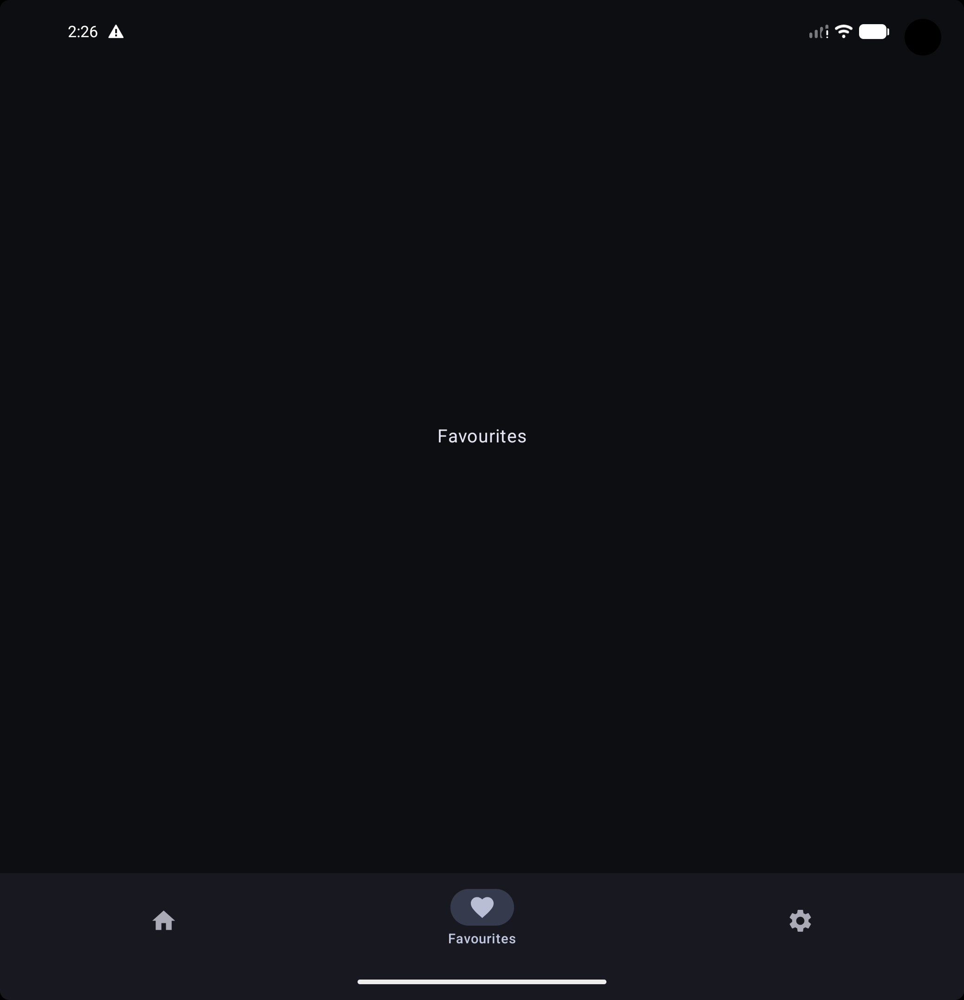
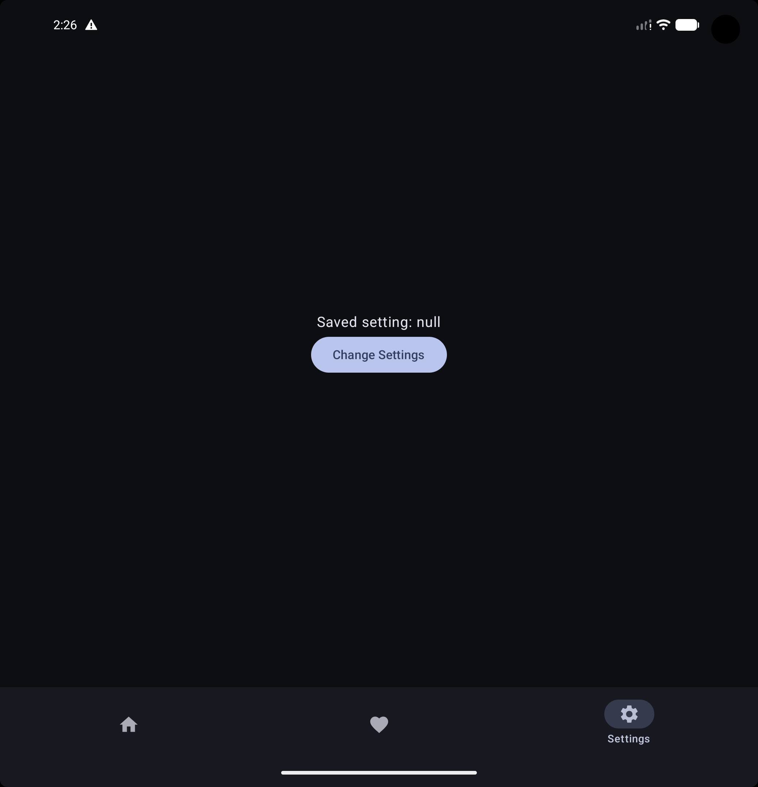
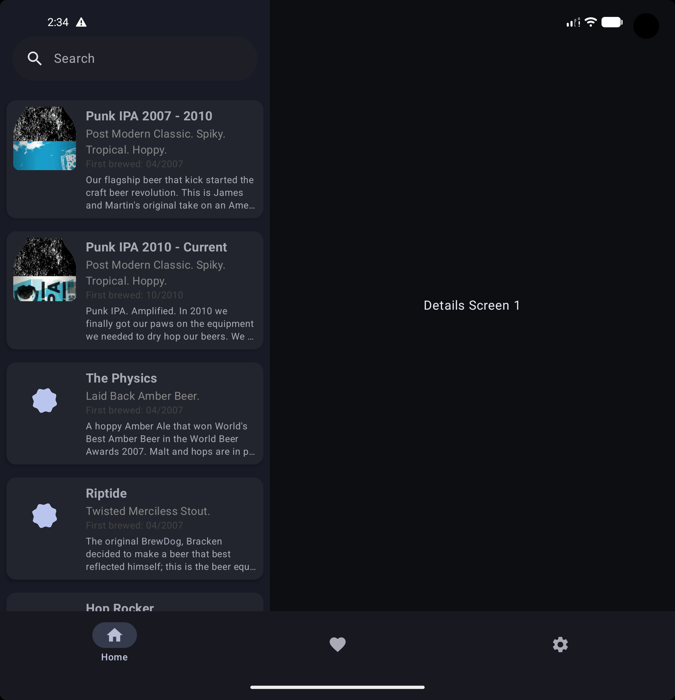
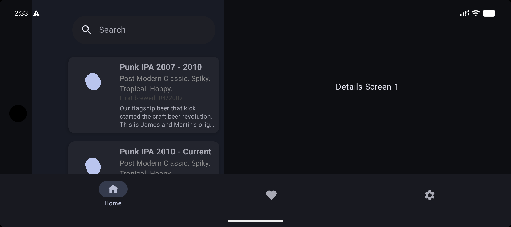

# Navigation 3 — Custom Back Stack + Bottom Navigation

A sample Android project using **Navigation Component (Navigation 3)** with:

- Independent back stacks per bottom navigation tab
- Custom pop / exit transitions
- Scene-based navigation flows
- Proper state restoration when switching tabs

Inspired by Google Navigation Recipes — adapted for real-world app structure.

---

## 📸 Screenshots

## 📸 Screenshots

<table>
  <tr>
    <td></td>
    <td></td>
  </tr>
  <tr>
    <td></td>
    <td></td>
  </tr>
  <tr>
    <td colspan="2" align="center">
      
    </td>
  </tr>
</table>


---

## 🚀 Tech Stack

- Kotlin
- Navigation3
- Compose 
- Material Components

---

## 🏗️ Project Goal

Explore advanced navigation patterns beyond default NavController behavior, while keeping transitions smooth and predictable.

---

## 📦 Setup

Clone the repo and open with Android Studio:

```bash
git clone https://github.com/yourusername/your-repo-name.git
```

Sync → Build → Run.

---

